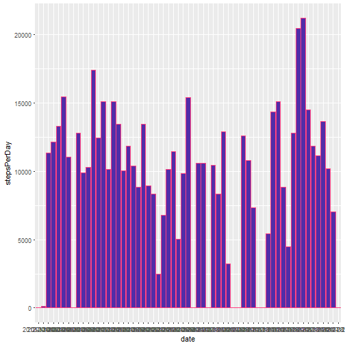
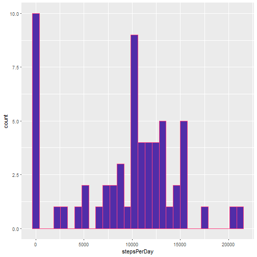
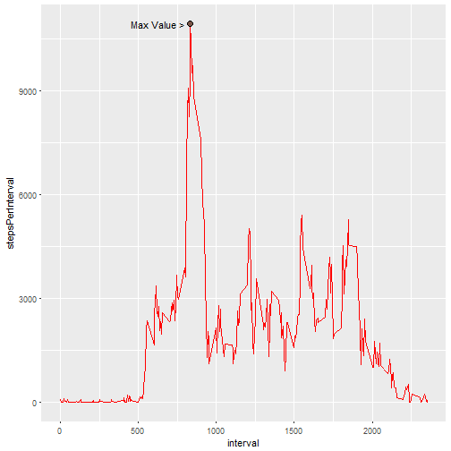
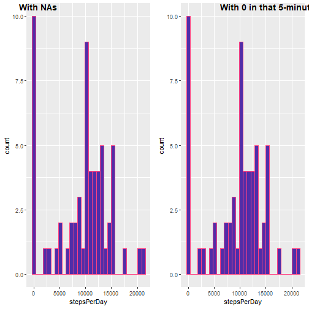
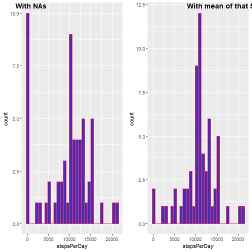
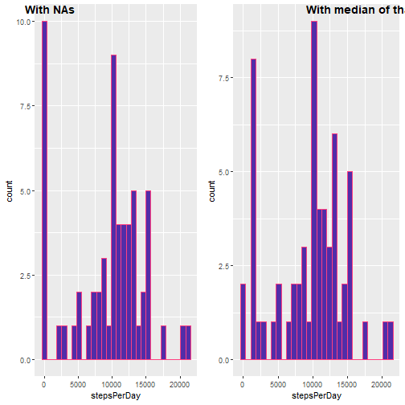
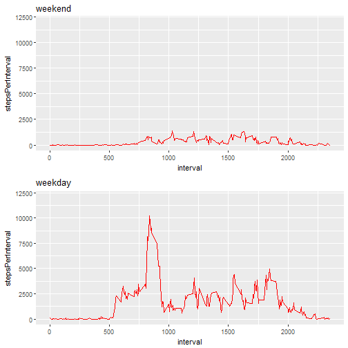
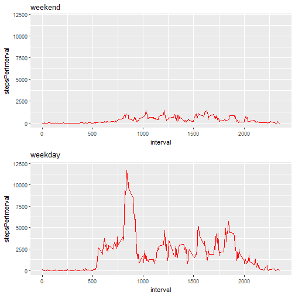
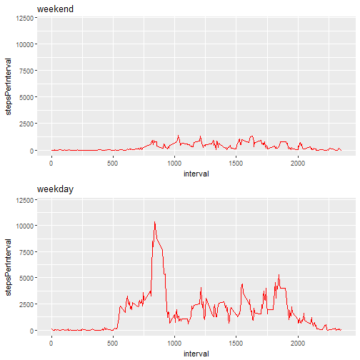
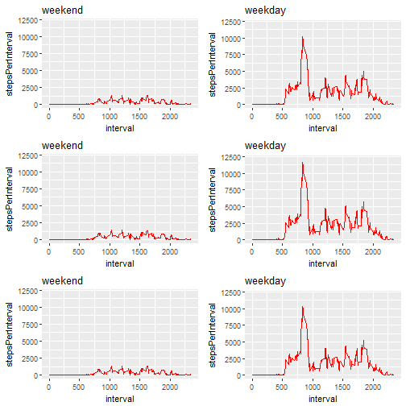

#Reproducible Research: Peer Assessment 1

## Loading and preprocessing the data

```r
library(dplyr)
library(ggplot2)
library(ggpubr)

MyData <- read.csv("activity.csv", header=TRUE, stringsAsFactors = FALSE, sep=",")
print ("Data loaded with read.csv")
```

```
## [1] "Data loaded with read.csv"
```
## What is mean total number of steps taken per day?

```r
NewGroup <- group_by(MyData, date)
NewGroup <- summarise(NewGroup, stepsPerDay = sum(steps, na.rm=TRUE), intervalsPerDay = n())
print("Steps per day")
```

```
## [1] "Steps per day"
```

```r
ggplot(NewGroup, aes(x = date, y = stepsPerDay, color = I("#FF4081"))) + geom_bar(stat = "identity", fill = I("#512DA8"))
```



```r
meanA <- mean(NewGroup$stepsPerDay, na.rm = TRUE)
medianA <- median(NewGroup$stepsPerDay, na.rm = TRUE)

print(paste("Mean of steps per day", meanA))
```

```
## [1] "Mean of steps per day 9354.22950819672"
```

```r
print(paste("Median of steps per day", medianA))
```

```
## [1] "Median of steps per day 10395"
```

```r
pA <- ggplot(NewGroup, aes(stepsPerDay, color = I("#FF4081")) ) + geom_histogram(fill = I("#512DA8"))
print (pA)
```

```
## `stat_bin()` using `bins = 30`. Pick better value with `binwidth`.
```



## What is the average daily activity pattern?


```r
NewGroup <- group_by(MyData, interval)
NewGroup <- summarise(NewGroup, stepsPerInterval = sum(steps, na.rm=TRUE), daysPerInterval = n())

maxValue <- max(NewGroup$stepsPerInterval, na.rm = TRUE)
maxInterval <- subset(NewGroup, stepsPerInterval == maxValue)

ggplot(NewGroup, 
       aes(x = interval, y = stepsPerInterval, group = 1, color = I("red"))) + 
       geom_line() + 
       annotate("text", x = maxInterval$interval - 210, y = maxInterval$stepsPerInterval, label = "Max Value >") +
       annotate("point", shape = 21, size = 3, x = maxInterval$interval, y = maxInterval$stepsPerInterval, fill = I("#795548"))
```



```r
print(paste("The interval with more steps is the number", maxInterval$interval, "with", maxValue, "steps taken"))
```

```
## [1] "The interval with more steps is the number 835 with 10927 steps taken"
```

## Imputing missing values


```r
totalNAs <- sum(is.na(MyData$steps))
totalRows <- nrow(MyData)
percetagofNAs <- totalNAs / totalRows

print(paste("Total of NAs in steps column:", totalNAs))
```

```
## [1] "Total of NAs in steps column: 2304"
```

```r
print(paste("Percentage of NAs in step column:", percetagofNAs))
```

```
## [1] "Percentage of NAs in step column: 0.131147540983607"
```

### Defining strategy to replace NAs.  
I will apply four strategies:

1. using the value 0
2. using the mean of that 5-minute interval
3. using the madian ot that 5-minute interval

### Using the value 0


```r
newData <- mutate(MyData, steps = ifelse(is.na(steps), 0, steps))

NewGroup <- group_by(newData, date)
NewGroup <- summarise(NewGroup, stepsPerDay = sum(steps, na.rm=TRUE), intervalsPerDay = n())
print("Steps per day")
```

```
## [1] "Steps per day"
```

```r
mean1 <- mean(NewGroup$stepsPerDay, na.rm = TRUE)
median1 <- median(NewGroup$stepsPerDay, na.rm = TRUE)

header <- c("Measure", "Original Dataset", "Using 0 instead of NAs")
row1 <- c("mean", meanA, mean1)              
row2 <- c("median", medianA, mean1)

a <- data.frame(header, row1, row2)
print(a)                  
```

```
##                   header             row1             row2
## 1                Measure             mean           median
## 2       Original Dataset 9354.22950819672            10395
## 3 Using 0 instead of NAs 9354.22950819672 9354.22950819672
```

```r
print("Do these values differ from the estimates from the first part of the assignment?")
```

```
## [1] "Do these values differ from the estimates from the first part of the assignment?"
```

```r
print("As we can see the value are the same.")
```

```
## [1] "As we can see the value are the same."
```

```r
p1 <- ggplot(NewGroup, aes(stepsPerDay, color = I("#FF4081")) ) + geom_histogram(fill = I("#512DA8"))

ggarrange(pA, p1,
          labels = c("With NAs", "With 0 in that 5-minute interval"), 
          ncol = 2, nrow = 1)
```

```
## `stat_bin()` using `bins = 30`. Pick better value with `binwidth`.
## `stat_bin()` using `bins = 30`. Pick better value with `binwidth`.
```



```r
print("What is the impact of imputing missing data on the estimates of the total daily number of steps?")
```

```
## [1] "What is the impact of imputing missing data on the estimates of the total daily number of steps?"
```

```r
print("In this case nothing happens.")
```

```
## [1] "In this case nothing happens."
```

### Using the mean of that 5-minute interval


```r
NewGroup <- group_by(MyData, interval)
NewGroup <- summarise(NewGroup, stepsPerInterval = sum(steps, na.rm=TRUE), daysPerInterval = n(), medianPerInterval = median(steps, na.rm=TRUE), meanPerInterval = mean(steps, na.rm=TRUE))

newData <- merge(MyData, NewGroup, by.x = "interval", by.y = "interval")
newData <- mutate(newData, steps = ifelse(is.na(steps), meanPerInterval, steps))

NewGroup <- group_by(newData, date)
NewGroup <- summarise(NewGroup, stepsPerDay = sum(steps, na.rm=TRUE), intervalsPerDay = n())
print("Steps per day")
```

```
## [1] "Steps per day"
```

```r
mean1 <- mean(NewGroup$stepsPerDay, na.rm = TRUE)
median1 <- median(NewGroup$stepsPerDay, na.rm = TRUE)

header <- c("Measure", "Original Dataset", "Using mean instead of NAs")
row1 <- c("mean", meanA, mean1)              
row2 <- c("median", medianA, mean1)

a <- data.frame(header, row1, row2)
print(a)                  
```

```
##                      header             row1             row2
## 1                   Measure             mean           median
## 2          Original Dataset 9354.22950819672            10395
## 3 Using mean instead of NAs 10766.1886792453 10766.1886792453
```

```r
print("Do these values differ from the estimates from the first part of the assignment?")
```

```
## [1] "Do these values differ from the estimates from the first part of the assignment?"
```

```r
print("As we can see the value are different.")
```

```
## [1] "As we can see the value are different."
```

```r
p1 <- ggplot(NewGroup, aes(stepsPerDay, color = I("#FF4081")) ) + geom_histogram(fill = I("#512DA8"))

ggarrange(pA, p1, 
          labels = c("With NAs", "With mean of that 5-minute interval"),
          ncol = 2, nrow = 1)
```

```
## `stat_bin()` using `bins = 30`. Pick better value with `binwidth`.
## `stat_bin()` using `bins = 30`. Pick better value with `binwidth`.
```



```r
print("What is the impact of imputing missing data on the estimates of the total daily number of steps?")
```

```
## [1] "What is the impact of imputing missing data on the estimates of the total daily number of steps?"
```

```r
print("In this case we can aprreciate that the graphic changes.")
```

```
## [1] "In this case we can aprreciate that the graphic changes."
```

### Using the median of that 5-minute interval


```r
NewGroup <- group_by(MyData, interval)
NewGroup <- summarise(NewGroup, stepsPerInterval = sum(steps, na.rm=TRUE), daysPerInterval = n(), medianPerInterval = median(steps, na.rm=TRUE), meanPerInterval = mean(steps, na.rm=TRUE))

newData <- merge(MyData, NewGroup, by.x = "interval", by.y = "interval")
newData <- mutate(newData, steps = ifelse(is.na(steps), medianPerInterval, steps))

NewGroup <- group_by(newData, date)
NewGroup <- summarise(NewGroup, stepsPerDay = sum(steps, na.rm=TRUE), intervalsPerDay = n())
print("Steps per day")
```

```
## [1] "Steps per day"
```

```r
mean1 <- mean(NewGroup$stepsPerDay, na.rm = TRUE)
median1 <- median(NewGroup$stepsPerDay, na.rm = TRUE)

header <- c("Measure", "Original Dataset", "Using median instead of NAs")
row1 <- c("mean", meanA, mean1)              
row2 <- c("median", medianA, mean1)

a <- data.frame(header, row1, row2)
print(a)                  
```

```
##                        header             row1             row2
## 1                     Measure             mean           median
## 2            Original Dataset 9354.22950819672            10395
## 3 Using median instead of NAs 9503.86885245902 9503.86885245902
```

```r
print("Do these values differ from the estimates from the first part of the assignment?")
```

```
## [1] "Do these values differ from the estimates from the first part of the assignment?"
```

```r
print("As we can see the values also are different.")
```

```
## [1] "As we can see the values also are different."
```

```r
p1 <- ggplot(NewGroup, aes(stepsPerDay, color = I("#FF4081")) ) + geom_histogram(fill = I("#512DA8"))

ggarrange(pA, p1, 
          labels = c("With NAs", "With median of that 5-minute interval"),
          ncol = 2, nrow = 1)
```

```
## `stat_bin()` using `bins = 30`. Pick better value with `binwidth`.
## `stat_bin()` using `bins = 30`. Pick better value with `binwidth`.
```



```r
print("What is the impact of imputing missing data on the estimates of the total daily number of steps?")
```

```
## [1] "What is the impact of imputing missing data on the estimates of the total daily number of steps?"
```

```r
print("In this case we can aprreciate that the graphic also changes.")
```

```
## [1] "In this case we can aprreciate that the graphic also changes."
```

## Are there difference

### Using the value 0
### Creating factor for weekday and weekend


```r
newData <- mutate(MyData, steps = ifelse(is.na(steps), 0, steps))
newData$typeDay <- ifelse(weekdays(as.Date(newData$date)) %in% c("sábado", "domingo"), "weekend", "weekday")

print(head(newData, 10))
```

```
##    steps       date interval typeDay
## 1      0 2012-10-01        0 weekday
## 2      0 2012-10-01        5 weekday
## 3      0 2012-10-01       10 weekday
## 4      0 2012-10-01       15 weekday
## 5      0 2012-10-01       20 weekday
## 6      0 2012-10-01       25 weekday
## 7      0 2012-10-01       30 weekday
## 8      0 2012-10-01       35 weekday
## 9      0 2012-10-01       40 weekday
## 10     0 2012-10-01       45 weekday
```

```r
print(table(newData$typeDay))
```

```
## 
## weekday weekend 
##   15264    2304
```

### Comparing weekday and weekend


```r
NewGroup <- select(newData, interval, steps, typeDay)
NewGroup <- filter(NewGroup, typeDay == "weekend")
NewGroup <- group_by(NewGroup, interval)
NewGroup <- summarise(NewGroup, stepsPerInterval = sum(steps, na.rm=TRUE), daysPerInterval = n())

p1 <- ggplot(NewGroup, 
       aes(x = interval, y = stepsPerInterval, group = 1, color = I("red"))) + 
       geom_line() + ylim(0, 12000) + ggtitle("weekend")

NewGroup <- select(newData, interval, steps, typeDay)
NewGroup <- filter(NewGroup, typeDay == "weekday")
NewGroup <- group_by(NewGroup, interval)
NewGroup <- summarise(NewGroup, stepsPerInterval = sum(steps, na.rm=TRUE), daysPerInterval = n())

p2 <- ggplot(NewGroup, 
       aes(x = interval, y = stepsPerInterval, group = 1, color = I("red"))) + 
       geom_line() + ylim(0, 12000) + ggtitle("weekday")

ggarrange(p1, p2, ncol = 1, nrow = 2)
```



```r
w1 <- p1
w2 <- p2
```

### Using the mean of that 5-minute interval
### Creating factor for weekday and weekend


```r
NewGroup <- group_by(MyData, interval)
NewGroup <- summarise(NewGroup, stepsPerInterval = sum(steps, na.rm=TRUE), daysPerInterval = n(), medianPerInterval = median(steps, na.rm=TRUE), meanPerInterval = mean(steps, na.rm=TRUE))

newData <- merge(MyData, NewGroup, by.x = "interval", by.y = "interval")
newData <- mutate(newData, steps = ifelse(is.na(steps), meanPerInterval, steps))
newData$typeDay <- ifelse(weekdays(as.Date(newData$date)) %in% c("sábado", "domingo"), "weekend", "weekday")

print(head(newData, 10))
```

```
##    interval    steps       date stepsPerInterval daysPerInterval
## 1         0 1.716981 2012-10-01               91              61
## 2         0 0.000000 2012-11-23               91              61
## 3         0 0.000000 2012-10-28               91              61
## 4         0 0.000000 2012-11-06               91              61
## 5         0 0.000000 2012-11-24               91              61
## 6         0 0.000000 2012-11-15               91              61
## 7         0 0.000000 2012-10-20               91              61
## 8         0 0.000000 2012-11-16               91              61
## 9         0 0.000000 2012-11-07               91              61
## 10        0 0.000000 2012-11-25               91              61
##    medianPerInterval meanPerInterval typeDay
## 1                  0        1.716981 weekday
## 2                  0        1.716981 weekday
## 3                  0        1.716981 weekend
## 4                  0        1.716981 weekday
## 5                  0        1.716981 weekday
## 6                  0        1.716981 weekday
## 7                  0        1.716981 weekday
## 8                  0        1.716981 weekday
## 9                  0        1.716981 weekday
## 10                 0        1.716981 weekend
```

```r
print(table(newData$typeDay))
```

```
## 
## weekday weekend 
##   15264    2304
```

### Comparing weekday and weekend


```r
NewGroup <- select(newData, interval, steps, typeDay)
NewGroup <- filter(NewGroup, typeDay == "weekend")
NewGroup <- group_by(NewGroup, interval)
NewGroup <- summarise(NewGroup, stepsPerInterval = sum(steps, na.rm=TRUE), daysPerInterval = n())

p1 <- ggplot(NewGroup, 
       aes(x = interval, y = stepsPerInterval, group = 1, color = I("red"))) + 
       geom_line() + ylim(0, 12000) + ggtitle("weekend")

NewGroup <- select(newData, interval, steps, typeDay)
NewGroup <- filter(NewGroup, typeDay == "weekday")
NewGroup <- group_by(NewGroup, interval)
NewGroup <- summarise(NewGroup, stepsPerInterval = sum(steps, na.rm=TRUE), daysPerInterval = n())

p2 <- ggplot(NewGroup, 
       aes(x = interval, y = stepsPerInterval, group = 1, color = I("red"))) + 
       geom_line() + ylim(0, 12000) + ggtitle("weekday")

ggarrange(p1, p2, ncol = 1, nrow = 2)
```



```r
w3 <- p1
w4 <- p2
```

### Using the median of that 5-minute interval
### Creating factor for weekday and weekend


```r
NewGroup <- group_by(MyData, interval)
NewGroup <- summarise(NewGroup, stepsPerInterval = sum(steps, na.rm=TRUE), daysPerInterval = n(), medianPerInterval = median(steps, na.rm=TRUE), meanPerInterval = mean(steps, na.rm=TRUE))

newData <- merge(MyData, NewGroup, by.x = "interval", by.y = "interval")
newData <- mutate(newData, steps = ifelse(is.na(steps), medianPerInterval, steps))
newData$typeDay <- ifelse(weekdays(as.Date(newData$date)) %in% c("sábado", "domingo"), "weekend", "weekday")

print(head(newData, 10))
```

```
##    interval steps       date stepsPerInterval daysPerInterval
## 1         0     0 2012-10-01               91              61
## 2         0     0 2012-11-23               91              61
## 3         0     0 2012-10-28               91              61
## 4         0     0 2012-11-06               91              61
## 5         0     0 2012-11-24               91              61
## 6         0     0 2012-11-15               91              61
## 7         0     0 2012-10-20               91              61
## 8         0     0 2012-11-16               91              61
## 9         0     0 2012-11-07               91              61
## 10        0     0 2012-11-25               91              61
##    medianPerInterval meanPerInterval typeDay
## 1                  0        1.716981 weekday
## 2                  0        1.716981 weekday
## 3                  0        1.716981 weekend
## 4                  0        1.716981 weekday
## 5                  0        1.716981 weekday
## 6                  0        1.716981 weekday
## 7                  0        1.716981 weekday
## 8                  0        1.716981 weekday
## 9                  0        1.716981 weekday
## 10                 0        1.716981 weekend
```

```r
print(table(newData$typeDay))
```

```
## 
## weekday weekend 
##   15264    2304
```

### Comparing weekday and weekend


```r
NewGroup <- select(newData, interval, steps, typeDay)
NewGroup <- filter(NewGroup, typeDay == "weekend")
NewGroup <- group_by(NewGroup, interval)
NewGroup <- summarise(NewGroup, stepsPerInterval = sum(steps, na.rm=TRUE), daysPerInterval = n())

p1 <- ggplot(NewGroup, 
       aes(x = interval, y = stepsPerInterval, group = 1, color = I("red"))) + 
       geom_line() + ylim(0, 12000) + ggtitle("weekend")

NewGroup <- select(newData, interval, steps, typeDay)
NewGroup <- filter(NewGroup, typeDay == "weekday")
NewGroup <- group_by(NewGroup, interval)
NewGroup <- summarise(NewGroup, stepsPerInterval = sum(steps, na.rm=TRUE), daysPerInterval = n())

p2 <- ggplot(NewGroup, 
       aes(x = interval, y = stepsPerInterval, group = 1, color = I("red"))) + 
       geom_line() + ylim(0, 12000) + ggtitle("weekday")

ggarrange(p1, p2, ncol = 1, nrow = 2)
```



```r
w5 <- p1
w6 <- p2

ggarrange(w1, w2, w3, w4, w5, w6, ncol = 2, nrow = 3)
```



End of this report
